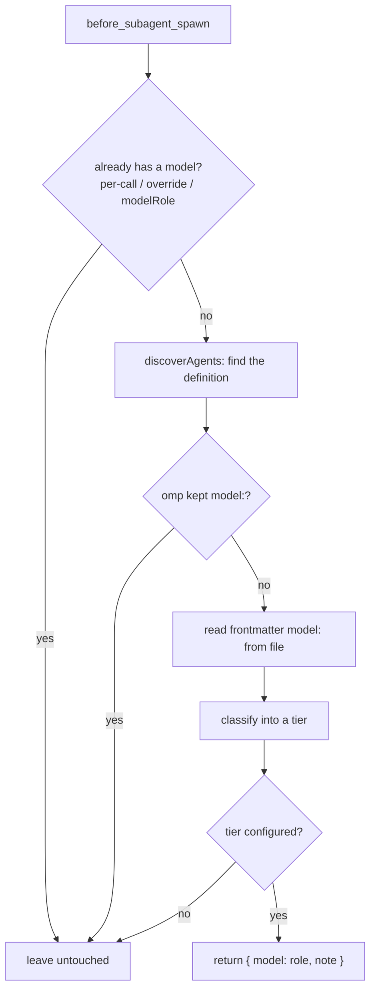

# omp-agent-role-router

An [omp](https://github.com/can1357/oh-my-pi) extension that gives a foreign subagent (a Claude
Code marketplace plugin's agent, mainly) an **omp model role** instead of letting it silently
inherit whatever model the parent session happens to be running.

## The problem

omp runs subagents defined by other harnesses — Claude Code marketplace plugins (ForgePlan's
`agents-core` / `agents-pro`: `guardian`, `adr-architect`, `planner`, `smith`, …) among them. Those
agents declare their model in Claude Code's own vocabulary: `model: opus | sonnet | haiku` in
YAML frontmatter.

**omp 18.3 drops that field for Claude Code-format plugins.** From the omp changelog, verbatim:

> Agents shipped by omp-installed marketplace plugins now honor their `model:` frontmatter instead
> of always inheriting `@default`; only Claude Code-format plugins (declaring
> `.claude-plugin/plugin.json`) keep dropping their provider-specific aliases.

So such an agent gets **no model of its own** and inherits the parent session's **currently active
model** — including mid-session retry fallbacks.

### Evidence

Reading omp 18.3.0's own discovery code (`src/task/discovery.ts`, `discoverAgents`) confirms the
mechanism precisely: for every Claude marketplace plugin root, omp checks
`pluginUsesClaudeModelDialect(plugin.path)` (`src/discovery/agent-plugin-format.ts`); when the
plugin declares `.claude-plugin/plugin.json` (the near-universal case — Agent Plugins-standard
`plugin.json` and native `.omp` agents are unaffected), the loader sets `agent.model = undefined`
for every one of its agents before returning them. The dropped tier is unrecoverable from the
spawn event: `before_subagent_spawn`'s `patterns` field is already the parent's inherited model by
the time the hook fires (see below) — an extension has to go back to the definition file itself.

Consequences, observed in real session logs (`~/.omp/agent/sessions/**`) before this extension
existed:

- Every foreign agent ran on the orchestrator's model: sonnet/haiku-tier agents (`planner`,
  `forge-advisor`, `ux-reviewer`) burned opus.
- When the orchestrator was on a retry fallback (e.g. the configured default chain landing on
  `openai-codex/gpt-5.6-sol` after an Anthropic hiccup), every agent spawned afterward inherited
  the fallback, not its own declared tier.
- The only built-in fix, `task.agentModelOverrides`, is one hand-written line per agent name — it
  goes stale with every plugin update and silently misses new agents.

## How it works

At `before_subagent_spawn` (fired once per spawned child, in the parent session, before the child
resolves its model — see `omp://extensions.md`), this extension:

1. Skips immediately if the spawn already has its own model: an explicit per-call model, a
   `task.agentModelOverrides` entry, or an event that already carries a resolved `modelRole`.
2. Re-derives the definition omp itself would spawn (`pi.pi.discoverAgents`, the same function
   core's own `task`/`eval` dispatch calls, so precedence — project `.omp/agents` over user
   `.omp/agents` over extension packages over Claude marketplace plugins, project scope before
   user scope, disabled plugins excluded — is never reimplemented, only reused).
3. If that definition's own model reaches core intact (a native `.omp` agent, or an Agent
   Plugins-standard / OMP-format plugin, neither of which loses its `model:`), leaves it alone.
4. Otherwise reads the definition file's own frontmatter `model:` directly and classifies it into a
   tier (`opus` / `sonnet` / `haiku` for Claude Code vocabulary; `gpt-flagship` / `gpt-mid` /
   `gpt-mini` for OpenAI/Codex vocabulary — see [Codex support](#codex-support-what-it-covers-and-what-it-cannot)).
5. Looks the tier up in `agentRoleRouter.tiers` (or a per-agent / per-plugin override) and returns
   that **role** — `@default`, `@task`, `@smol`, or whatever the config says — as the hook's
   `model`. Never a concrete model: what the role actually resolves to stays entirely governed by
   the user's own `modelRoles` and `retry.fallbackChains`.



## Install

```sh
omp plugin install github:fedorovvvv/omp-agent-role-router
```

This is `omp plugin`'s documented git-source form (`docs/plugin-manager-installer-plumbing.md`):
it `bun install`s the repository into `~/.omp/plugins`, symlinks it into that scope's
`node_modules`, and — because `package.json` declares `omp.extensions: ["./src/index.ts"]` — the
extension loader imports it on every session start. No build step: omp's extension loader
transpiles `.ts` at load time, the same way `-e path/to/file.ts` does.

To try it without installing:

```sh
omp -e path/to/omp-agent-role-router/src/index.ts
```

Or for local development, symlink instead of publishing a version:

```sh
omp plugin link path/to/omp-agent-role-router
```

## Configuration

Zero-config already does the useful thing:

```yaml
opus   → @default
sonnet → @task
haiku  → @smol
```

(plus the Codex/OpenAI equivalents — see below). To change it, add an `agentRoleRouter` block to
`~/.omp/agent/config.yml` (user) and/or `<project>/.omp/config.yml` (project). omp's settings
layers tolerate unknown top-level keys (verified: `omp config set` on a file carrying an unrelated
top-level block leaves it untouched across a real load/save cycle), so this needs no schema
registration — it is read directly off `Settings#getGlobalSettings()` /
`Settings#getProjectSettings()`, the same "raw namespaced key" seam the SDK shim documents for
extensions (`getGlobalSettings()`/`getProjectSettings()` deep-clone the raw layers precisely so an
extension can read its own keys — `docs/porting-from-pi-mono.md`).

```yaml
# ~/.omp/agent/config.yml or <project>/.omp/config.yml
agentRoleRouter:
  enabled: true # false disables routing entirely; default true
  debug: false # true logs every decision (also: OMP_AGENT_ROLE_ROUTER_DEBUG=1)

  # Tier → role. Values are omp role aliases ("@task", "@task:high") or `false`
  # ("route nothing for this tier, leave the spawn alone").
  tiers:
    opus: "@default"
    sonnet: "@task"
    haiku: "@smol"
    gpt-flagship: "@default"
    gpt-mid: "@task"
    gpt-mini: "@smol"

  # Exact agent name → role. Wins over every tier rule, plugin or not.
  agents:
    guardian: "@slow"
    some-noisy-agent: false # pin it to whatever it inherits; never touch it

  # Exact plugin name (its manifest's `name` field) → per-tier rules, or
  # `false` to leave every agent of that plugin alone.
  plugins:
    agents-core:
      opus: "@slow" # only agents-core's opus-tier agents go to @slow
    some-plugin: false
```

**Precedence** (first match wins, evaluated in this order once a spawn is eligible for routing at
all): `agents.<name>` → `plugins.<plugin>.<tier>` → `tiers.<tier>`. Across config layers, the
project file's `agentRoleRouter.enabled`/`debug` and each `tiers`/`agents` entry replace the same
key from the user file; `plugins.<name>` **merges** per-tier rules between layers unless the project
sets the whole plugin to `false`. Layer merge itself follows omp's own precedence
(project shadows user) — see `docs/settings.md`.

### `agentModelOverrides` vs `agentRoleRouter`

The two are complementary, not competing — `agentModelOverrides` wins outright over this
extension (checked first, before the hook even fires — see [Precedence](#precedence-vs-omp-itself)
below), by design:

| | `task.agentModelOverrides` | `agentRoleRouter` |
| --- | --- | --- |
| Granularity | one exact agent name → one concrete model/role | a whole *tier*, automatically |
| New plugin agent | invisible until you add a line | routed immediately by its declared tier |
| Value | a model selector or role | a role only, never a model |
| Best for | "this *specific* agent needs a specific model regardless of its tier" | "every opus-tier agent should get `@default`" |

Use `agentModelOverrides` for the exceptions; this extension for the rule.

## Precedence vs omp itself

This extension only ever returns a role for a spawn that would otherwise **silently inherit the
parent's live model with no model of its own**. Concretely, from `src/router.ts`'s `decide()`:

1. `event.modelRole` already set → left alone (core already resolved a role).
2. `task.agentModelOverrides` has an entry for this agent → left alone.
3. The spawn's patterns are not *exactly* `[parentActiveModel]` (an explicit per-call model, or an
   already-configured retry-fallback chain) → left alone.
4. The definition omp resolves for this name kept its own `model:` (native `.omp` agent, or an
   Agent Plugins-standard/OMP-format plugin) → left alone.
5. The definition declares no model, or a model this extension cannot classify, or a tier with no
   configured role → left alone; the `note`/debug log states exactly why.

Nothing here is ever guessed: an unrecognised model id, or a tier absent from `agentRoleRouter.tiers`,
leaves the spawn exactly as omp would have run it.

## Codex support: what it covers and what it cannot

The tier classifier (`src/tiers.ts`) recognises OpenAI/Codex model ids too (`gpt-5.6-sol` →
`gpt-flagship`, `gpt-5.6-terra` → `gpt-mid`, `gpt-5.6-luna`/`*-mini`/`*-nano`/`codex-mini-latest` →
`gpt-mini`, and the `gpt-6-*` family), because a frontmatter `model:` field can technically hold any
string, including one written for the Codex CLI by a cross-runtime plugin author. This is exercised
by unit tests, not a live probe: **no installed Claude marketplace agent in this environment
declares an OpenAI-vocabulary `model:`**, so there is no live case to route in the verification
table below.

**Codex's own subagents and plugin agents cannot reach omp's task tool at all — verified two ways:**

1. **Source**: omp 18.3.0's `discoverAgents` (`src/task/discovery.ts`) merges exactly five sources
   — project `.omp/agents`, user `.omp/agents`, OMP extension-package `agents/` roots, Claude
   marketplace plugin `agents/` roots (gated on `enabledProviders: [claude-plugins]`), and bundled
   agents. `.codex/agents/*.toml` (Codex's own custom-subagent format —
   `~/.codex/agents/*.toml` / `<project>/.codex/agents/*.toml`, confirmed against
   `codex-rs/agent-roles/{agent_role_config,discovery}.rs` and
   `https://learn.chatgpt.com/docs/agent-configuration/subagents`) and `~/.codex/plugins/**`
   (Codex's own plugin cache, an entirely separate registry from
   `~/.claude/plugins/installed_plugins.json`) are never scanned by any of the five sources.
2. **Live probe**: the Figma Codex plugin (`~/.codex/plugins/cache/openai-curated-remote/figma`)
   ships an agent named `design-parity-review-agent`. The *same-id* Claude-side install
   (`~/.claude/plugins/cache/claude-plugins-official/figma`) has no `agents/` directory at all —
   this agent genuinely exists only on the Codex side. Asked to spawn it:

   ```
   $ omp -p --model anthropic/claude-haiku-4-5 "Call the task tool with agent 'design-parity-review-agent'…"
   Task … failed preflight: Unknown agent "design-parity-review-agent". Available: forge-advisor, …
   ```

   Confirmed unreachable, exactly as the source predicts.

So "Codex support" here means precisely: **if a Codex-flavored model id ever appears in the
`model:` field of a definition omp *does* discover** (a Claude-dialect plugin frontmatter, in
practice), it is classified and routed the same as a Claude-vocabulary one. It does **not** mean
Codex's own custom agents or plugin agents become spawnable — that path does not exist in omp
18.3.0, and no code here pretends otherwise.

## Verified with omp 18.3.x

Probe method (per the reference prototype run this extension's design followed): a throwaway
project directory with `enabledProviders: [claude-plugins]` in `.omp/config.yml` (outside a project
that already enables it), `omp -p --model <parent> -e src/index.ts "call task with agents …"`, then
reading `model_change` lines from `~/.omp/agent/sessions/<cwd-slug>/<parent-session>/<child>.jsonl`.
`OMP_AGENT_ROLE_ROUTER_DEBUG=1` was set to also capture this extension's own decision log.

Parent model for the run: `anthropic/claude-haiku-4-5` (via `--model`). All four spawned as a single
`task` batch from the ForgePlan `agents-core@1.13.0` marketplace plugin (Claude-dialect,
`model:` dropped by omp).

| agent | declared tier (frontmatter) | routed to | resolved model | how |
| --- | --- | --- | --- | --- |
| `guardian` | `opus` | `@default` | `anthropic/claude-haiku-4-5` | this extension |
| `planner` | `sonnet` | `@task` | `anthropic/claude-sonnet-5` | this extension |
| `forge-advisor` | `haiku` | `@smol` | `zai/glm-5.3-flash` | this extension |
| `tester` | `sonnet` | *(untouched)* | `zai/glm-5.3` | `task.agentModelOverrides.tester` (pre-existing) |

Every resolved model in the `model_change` log line matches the table exactly. `guardian`
resolving to `haiku` rather than the configured `modelRoles.default` (`anthropic/claude-opus-5-5`)
is **not** a bug in this extension: `omp --model X` rebinds the `default` role to `X` for that
whole process (`overrideModelRoles({default: X})` — this is documented, deliberate CLI behavior,
not something an extension can or should see around). `tester` was correctly left alone —
`task.agentModelOverrides` still wins outright, per the precedence above.

## Known limitations

- **`before_subagent_spawn` fires once per spawn, before this extension can see the *previous*
  spawn's outcome.** No cross-spawn state is kept beyond a per-message "already warned about this"
  dedup set.
- **A spawn this extension routes to a role can lose that role's own retry-fallback chain** — see
  the bug below. In practice this only matters when the *primary* model for that role is itself
  unavailable.
- **Classification is heuristic, not exhaustive.** `src/tiers.ts` recognises the Claude and
  OpenAI/Codex vocabularies documented above; an id from a different provider family, or a
  genuinely new naming scheme, classifies as unknown and is left untouched rather than guessed.
  Extend it (or add an `agents`/`plugins` override) for anything it misses.
- **omp's own per-file discovery cache is bypassed by design.** This extension keeps its own
  mtime-keyed snapshot (`src/agents.ts`) rather than calling `discoverAgents` on every spawn, so a
  plugin update or a hand-edited agent file is picked up on the next spawn after its stat changes,
  not necessarily the instant it changes.

### A real omp behavior worth reporting upstream

**A `before_subagent_spawn` hook's returned role-alias `model` does not carry its role identity
into retry-fallback-chain selection**, contradicting the extensions.md doc text ("A returned
`model` replaces the spawn's attempt-ordered patterns while keeping the original role identity, so
the remaining entries become the child's retry fallback chain"). Traced to
`task/structured-subagent.ts`'s `applySpawnHook`:

```ts
const replacement = resolveConfiguredModelPatterns(spawnResult.model, request.session.settings);
if (replacement.length === 0) return policy;
return { ...policy, modelOverride: replacement, modelRoute: spawnResult.note };
```

`spawnResult.model` (`"@task"`, in this extension's case) is expanded to concrete patterns
immediately and only `modelOverride`/`modelRoute` are updated — `policy.modelRole` (computed once,
*before* the hook runs, from the pre-hook patterns) is never refreshed from the hook's own role
identity. Downstream, `runSubagent` (`task/executor.ts`) infers the retry-fallback chain from
`modelRole ?? resolveExplicitModelRole(modelPatterns, subagentSettings)` — but by then
`modelPatterns` is also the already-expanded concrete list (no `@` prefix left for
`resolveExplicitModelRole` to find), so the inference falls through to `retry.fallbackChains.default`
regardless of which role the hook actually chose.

**Reproduced live** in the verification run above (`retry.fallbackChains`: `task: [gpt-5.6-terra,
glm-5.3]`, `smol: [claude-haiku-4-5, gpt-6-luna]`, `default: [opus-5-5, sonnet-5, gpt-5.6-sol,
gpt-6-astra]`): the parent session itself hit a transient Anthropic failure and fell back from
`claude-haiku-4-5` to `openai-codex/gpt-5.6-sol` (`default[2]`) before dispatching the batch. Every
child inherited that live model as its starting pattern, then — on its own first-call failure —
**every child's retry landed on `openai-codex/gpt-5.6-sol` too**, including `planner` (routed to
`@task`, whose own chain is `[gpt-5.6-terra, glm-5.3]` — neither of which is `gpt-5.6-sol`) and
`forge-advisor` (routed to `@smol`, whose own chain is `[claude-haiku-4-5, gpt-6-luna]` — again,
neither is `gpt-5.6-sol`). `guardian` (routed to `@default`) landed on the *correct* chain only
because its target role and the process's rebound default role were the same thing. This matches
exactly what the design brief's own prototype probe had flagged (fact 9) — confirmed here at the
source level, not just observed behaviorally.

This is a limitation of omp's hook API, not of this extension: there is no available seam
(`before_subagent_spawn`'s result shape has no `modelRole` field) for a hook to also correct the
retry-chain role identity it changed. Filed for awareness; not worked around here, per this
project's brief ("don't hack around it").

## FAQ

**Why not just fix `task.agentModelOverrides`?** You can, per agent, forever, by hand, for every
plugin update. This extension routes by declared *tier*, so a plugin author adding a new
sonnet-tier agent tomorrow gets `@task` tomorrow, with zero action from you.

**Does this touch my `modelRoles` or `retry.fallbackChains`?** No, and it never will. It returns a
role *name*; what that role resolves to is entirely your `modelRoles` configuration, exactly as if
you had typed `@task` yourself.

**What if I don't want a specific plugin touched at all?** `agentRoleRouter.plugins.<name>: false`.

**What about Codex's own custom agents / plugin agents?** They cannot reach omp's task tool in omp
18.3.0 at all — see [Codex support](#codex-support-what-it-covers-and-what-it-cannot). Nothing to
route.

**Does it slow spawns down?** Discovery and plugin-manifest reads are cached by input mtimes
(`src/agents.ts`); an unchanged tree costs one `stat` per watched path and zero file reads on every
spawn after the first.

## Development

```sh
bun install
bun run typecheck
bun test
```

## License

MIT © Nikita Fedorov
