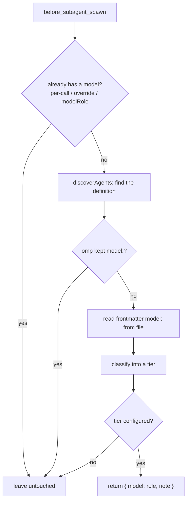

# How it works

## Why omp needs this at all

omp runs subagents defined by other harnesses — Claude Code marketplace plugins (ForgePlan's
`agents-core` / `agents-pro`: `guardian`, `adr-architect`, `planner`, `smith`, …) among them. Those
agents declare their model in Claude Code's own vocabulary: `model: opus | sonnet | haiku` in YAML
frontmatter.

**omp 18.3 drops that field for Claude Code-format plugins.** From the omp changelog, verbatim:

> Agents shipped by omp-installed marketplace plugins now honor their `model:` frontmatter instead
> of always inheriting `@default`; only Claude Code-format plugins (declaring
> `.claude-plugin/plugin.json`) keep dropping their provider-specific aliases.

So such an agent gets **no model of its own** and inherits the parent session's **currently active
model** — including mid-session retry fallbacks.

### Where this happens in omp's own code

Reading omp 18.3.0's discovery code (`src/task/discovery.ts`, `discoverAgents`) confirms the
mechanism precisely: for every Claude marketplace plugin root, omp checks
`pluginUsesClaudeModelDialect(plugin.path)` (`src/discovery/agent-plugin-format.ts`); when the
plugin declares `.claude-plugin/plugin.json` (the near-universal case — Agent Plugins-standard
`plugin.json` and native `.omp` agents are unaffected), the loader sets `agent.model = undefined`
for every one of its agents before returning them. The dropped tier is unrecoverable from the spawn
event: `before_subagent_spawn`'s `patterns` field is already the parent's inherited model by the
time the hook fires — an extension has to go back to the definition file itself.

## The decision flow

At `before_subagent_spawn` (fired once per spawned child, in the parent session, before the child
resolves its model — see `omp://extensions.md`), this extension:

1. Skips immediately if the spawn already has its own model: an explicit per-call model, a
   `task.agentModelOverrides` entry, or an event that already carries a resolved `modelRole`.
2. Re-derives the definition omp itself would spawn (`pi.pi.discoverAgents`, the same function
   core's own `task`/`eval` dispatch calls, so precedence — project `.omp/agents` over user
   `.omp/agents` over extension packages over Claude marketplace plugins, project scope before
   user scope, disabled plugins excluded — is never reimplemented, only reused).
3. If that definition's own model reaches core intact (a native `.omp` agent, or an Agent
   Plugins-standard / OMP-format plugin, neither of which loses its `model:`), leaves it alone.
4. Otherwise reads the definition file's own frontmatter `model:` directly and classifies it into a
   tier (`opus` / `sonnet` / `haiku` for Claude Code vocabulary; `gpt-flagship` / `gpt-mid` /
   `gpt-mini` for OpenAI/Codex vocabulary — see [Codex support](#codex-support) below).
5. Looks the tier up in `agentRoleRouter.tiers` (or a per-agent / per-plugin override) and returns
   that **role** — `@default`, `@task`, `@smol`, or whatever the config says — as the hook's
   `model`. Never a concrete model: what the role actually resolves to stays entirely governed by
   the user's own `modelRoles` and `retry.fallbackChains`.



## Precedence, exactly

This extension only ever returns a role for a spawn that would otherwise **silently inherit the
parent's live model with no model of its own**. Concretely, from `src/router.ts`'s `decide()`:

1. `event.modelRole` already set → left alone (core already resolved a role).
2. `task.agentModelOverrides` has an entry for this agent → left alone.
3. The spawn's patterns are not *exactly* `[parentActiveModel]` (an explicit per-call model, or an
   already-configured retry-fallback chain) → left alone.
4. The definition omp resolves for this name kept its own `model:` (native `.omp` agent, or an
   Agent Plugins-standard/OMP-format plugin) → left alone.
5. The definition declares no model, or a model this extension cannot classify, or a tier with no
   configured role → left alone; the `note`/debug log states exactly why.

Nothing here is ever guessed: an unrecognised model id, or a tier absent from
`agentRoleRouter.tiers`, leaves the spawn exactly as omp would have run it.

## Configuration reference

```yaml
# ~/.omp/agent/config.yml or <project>/.omp/config.yml
agentRoleRouter:
  enabled: true # false disables routing entirely; default true
  debug: false # true logs every decision (also: OMP_AGENT_ROLE_ROUTER_DEBUG=1)

  tiers:
    opus: "@default"
    sonnet: "@task"
    haiku: "@smol"
    gpt-flagship: "@default"
    gpt-mid: "@task"
    gpt-mini: "@smol"

  agents:
    guardian: "@slow"
    some-noisy-agent: false # pin it to whatever it inherits; never touch it

  plugins:
    agents-core:
      opus: "@slow" # only agents-core's opus-tier agents go to @slow
    some-plugin: false
```

Lookup order once a spawn is eligible for routing at all: `agents.<name>` →
`plugins.<plugin>.<tier>` → `tiers.<tier>`. Across config layers, the project file's
`agentRoleRouter.enabled`/`debug` and each `tiers`/`agents` entry replace the same key from the
user file; `plugins.<name>` **merges** per-tier rules between layers unless the project sets the
whole plugin to `false`. Layer merge itself follows omp's own precedence (project shadows user) —
see `docs/settings.md` in omp's own docs.

omp's settings layers tolerate unknown top-level keys (verified: `omp config set` on a file
carrying an unrelated top-level block leaves it untouched across a real load/save cycle), so
`agentRoleRouter` needs no schema registration — it is read directly off
`Settings#getGlobalSettings()` / `Settings#getProjectSettings()`, the same "raw namespaced key"
seam the SDK shim documents for extensions.

### `agentModelOverrides` vs `agentRoleRouter`

| | `task.agentModelOverrides` | `agentRoleRouter` |
| --- | --- | --- |
| Granularity | one exact agent name → one concrete model/role | a whole *tier*, automatically |
| New plugin agent | invisible until you add a line | routed immediately by its declared tier |
| Value | a model selector or role | a role only, never a model |
| Best for | "this *specific* agent needs a specific model regardless of its tier" | "every opus-tier agent should get `@default`" |

Use `agentModelOverrides` for the exceptions; this extension for the rule.

## Codex support

The tier classifier (`src/tiers.ts`) recognises OpenAI/Codex model ids too (`gpt-5.6-sol` →
`gpt-flagship`, `gpt-5.6-terra` → `gpt-mid`, `gpt-5.6-luna`/`*-mini`/`*-nano`/`codex-mini-latest` →
`gpt-mini`, and the `gpt-6-*` family), because a frontmatter `model:` field can technically hold any
string, including one written for the Codex CLI by a cross-runtime plugin author. This is exercised
by unit tests, not a live probe: no installed Claude marketplace agent in this environment declares
an OpenAI-vocabulary `model:`, so there is no live case to route in the verification table
(`docs/verification.md`).

**Codex's own subagents and plugin agents cannot reach omp's task tool at all** — verified two ways:

1. **Source**: omp 18.3.0's `discoverAgents` (`src/task/discovery.ts`) merges exactly five sources
   — project `.omp/agents`, user `.omp/agents`, OMP extension-package `agents/` roots, Claude
   marketplace plugin `agents/` roots (gated on `enabledProviders: [claude-plugins]`), and bundled
   agents. `.codex/agents/*.toml` (Codex's own custom-subagent format — `~/.codex/agents/*.toml` /
   `<project>/.codex/agents/*.toml`, confirmed against
   `codex-rs/agent-roles/{agent_role_config,discovery}.rs` and
   `https://learn.chatgpt.com/docs/agent-configuration/subagents`) and `~/.codex/plugins/**`
   (Codex's own plugin cache, an entirely separate registry from
   `~/.claude/plugins/installed_plugins.json`) are never scanned by any of the five sources.
2. **Live probe**: the Figma Codex plugin (`~/.codex/plugins/cache/openai-curated-remote/figma`)
   ships an agent named `design-parity-review-agent`. The *same-id* Claude-side install
   (`~/.claude/plugins/cache/claude-plugins-official/figma`) has no `agents/` directory at all —
   this agent genuinely exists only on the Codex side. Asked to spawn it:

   ```
   $ omp -p --model anthropic/claude-haiku-4-5 "Call the task tool with agent 'design-parity-review-agent'…"
   Task … failed preflight: Unknown agent "design-parity-review-agent". Available: forge-advisor, …
   ```

   Confirmed unreachable, exactly as the source predicts.

So "Codex support" here means precisely: **if a Codex-flavored model id ever appears in the
`model:` field of a definition omp *does* discover** (a Claude-dialect plugin frontmatter, in
practice), it is classified and routed the same as a Claude-vocabulary one. It does **not** mean
Codex's own custom agents or plugin agents become spawnable — that path does not exist in omp
18.3.0, and no code here pretends otherwise.

## FAQ

**Why not just fix `task.agentModelOverrides`?** You can, per agent, forever, by hand, for every
plugin update. This extension routes by declared *tier*, so a plugin author adding a new
sonnet-tier agent tomorrow gets `@task` tomorrow, with zero action from you.

**Does this touch my `modelRoles` or `retry.fallbackChains`?** No, and it never will. It returns a
role *name*; what that role resolves to is entirely your `modelRoles` configuration, exactly as if
you had typed `@task` yourself.

**What if I don't want a specific plugin touched at all?** `agentRoleRouter.plugins.<name>: false`.

**What about Codex's own custom agents / plugin agents?** They cannot reach omp's task tool in omp
18.3.0 at all — see [Codex support](#codex-support). Nothing to route.

**Does it slow spawns down?** Discovery and plugin-manifest reads are cached by input mtimes
(`src/agents.ts`); an unchanged tree costs one `stat` per watched path and zero file reads on every
spawn after the first.
